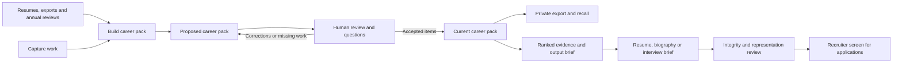

# career.json

**Your career, in a file you own.**

A Claude-native career evidence toolkit with an optional resume application.
The evidence record and document generation have separate release readiness.

| Component | Status | Purpose |
| --- | --- | --- |
| **Career Evidence Core** | Early access: `0.1.0-alpha.2` | Capture, review, maintain and privately export a portable career record |
| **Resume Application** | Beta: `0.1.0-beta.2` | Select, tailor, review and render documents from that record |

Both live in this repository. The core runs independently; the resume add-on
consumes it through the versioned career schema. Start with the
[core workflow](docs/core-workflow.md), add the
[resume workflow](docs/resume-workflow.md) when useful, and see
[release boundaries and installation](docs/releases.md) for the separate local
archives and quality gates. Broader onboarding and resume benchmarks remain
necessary before either component is described as mature.

## The problem

A long career has two failure modes, and they pull against each other.

**You forget.** The stalled programme you unblocked in two weeks, the migration
that halved a bill, the incident you ran at 3am. None of it gets written down at
the time, and eighteen months later it is gone. By the time you need it, you are
reconstructing your own career from memory and a stale resume.

**You have too much.** Once there is enough to remember, no single resume can
carry it. Every role wants a different subset, and hand-curating that from a
ten-page document, for every application, is miserable enough that most people
send the same resume everywhere.

## The idea

Keep one durable, structured record of your career. Treat resumes as **disposable
outputs** of it, not as the thing you maintain.

The record is a **datapack**: evidence atoms in STAR form, employment history,
skills, each traceable to the source it came from. The pack is the product. A
resume is a query against it, shaped for one role.

Two rules govern the record and its applications:

- **Claims must be grounded.** Every claim must trace to recorded evidence. Every
  employer, title, and date must trace to an employment record. If evidence for something does not
  exist, the document says less rather than more.
- **The record knows what it does not know.** Unresolved claims, inferred dates,
  gaps in the timeline, and evidence that would read badly for a given role are
  all recorded rather than smoothed over.

## What this is not

- **Not a recruiter.** `recruiter-screen` is a model performing a cold read. It
  catches obvious rejections cheaply. It is not calibrated against real hiring
  outcomes, so treat a verdict as a well-argued opinion, not a prediction.
- **Not an extraction guarantee.** Ingestion reads what the PDF gives it, and a
  two-column layout or a scan will lose things. That is why every claim records
  where it came from and why `make coverage` exists to show you the holes.
- **Not a tracker, job board, or autofill.** It produces documents. Applying is
  still yours.
- **Not a way to make a thin record look thick.** Where evidence is missing the
  document says less, which occasionally means telling you something you did not
  want to hear.

## Quick start

You need [Claude Code](https://claude.com/claude-code) and a Claude plan that
covers it, Python 3.9 or later, `make`, and macOS or Linux. Runs consume tokens
like any other Claude session; a first pack build over a long resume is the
expensive one, and everything after it is small.

```sh
git clone https://github.com/rkovar/career-json.git
cd career-json
make check                      # confirm the workspace is sound
make hooks                      # optional: validate on commit
```

Outside macOS, PDF sources also need poppler (`apt install poppler-utils`).

Put your material in `data/sources/` — a resume, a LinkedIn export, an
end-of-year write-up, whatever you have to start with. Then, in Claude Code:

```
Use build-career-pack on everything in data/sources/
```

It stages a proposed pack and produces a private HTML review page. Review your
history, achievements and source excerpts in batches of five. Accept accurate
wording, request corrections, defer items, and choose external-use permission
separately. Download your decisions and give the file back to the tool to save
accepted items. Pending proposals stay outside the current career pack.

`review-evidence` asks follow-up questions one at a time and records your answers.
Use `review-strengths` to explore supported strengths and future direction; the
interview can pause or be skipped. Once you have an accepted pack, you can stop
here and privately export it:

```sh
make strengths
python3 scripts/career_core.py export --output data/private/career-export.json
```

Resume generation is an optional beta application. In the combined checkout it is
already available; core-only archive users install the add-on first. Then:

```
Use make-resume for Head of Platform Engineering
```

You get a draft, an integrity evaluation, and a recruiter's verdict on whether it
would actually be shortlisted:

```
verdict  borderline

reason                Credible senior delivery evidence, but nothing showing
                      ownership of a team, a roadmap or a budget, which is the
                      thing the role hires for.
fixable by rewrite    2 of 5 weaknesses
needs new evidence    3 of 5
first change          Capture evidence of team, budget or roadmap ownership.
                      Without it this role is a reach whatever the document says.
```

An unflattering first verdict is the system working. See
[examples/walkthrough](examples/walkthrough/) for the complete fictional run:
the pack, the draft, the evaluation record, and the full screen.

## Review what the system recorded

The review page includes your career timeline, achievements, education, original
source excerpts, supported strengths and future preferences. It shows previous
values alongside proposed changes and asks about missing or understated work.

| Your choice | What happens |
| --- | --- |
| Looks accurate | Accepts the exact wording; does not independently verify it |
| Correct this | Saves your explanation for a revised proposal |
| Not sure / Review later | Keeps the item pending and preserves the previous record |
| Keep private | Restricts external use independently of wording acceptance |
| Allow externally | Requires acceptance of the exact proposed content |

New or changed content stays private unless you separately allow external use.
Saved decisions apply to the exact proposal; materially changed content needs a
fresh review. You can accept part of a proposal and return to the rest later,
provided its supporting records are accepted together.

The HTML works offline. Download decisions to keep a portable copy, then give the
file to the tool for import; the browser does not directly change your pack.
See [career-pack review](docs/pack-review.md) for commands and correction handling.
`make pack-html` provides a separate read-only overview of the current record.

## The loop



**Start from the resume you already have.** The first run bootstraps the pack
from whatever exists today — a resume, a LinkedIn export, an old CV in a drawer.
It gives you a first record to inspect and correct. Later imports extend that
record while preserving sources, stable IDs and earlier versions.

**Capture continuously.** `capture-work` records a one-line note in seconds and
never touches the pack, because a note that costs a pack version is a note nobody
writes.

**Import the annual write-up.** Your end-of-year self-review is the biggest
capture event of the year. It is handled as a review period: deduplicated against
what you already have, dated from the document, and defaulted to internal-only
because a self-review is written for an employer.

**Curate per role.** Selection ranks your evidence against the role's
requirements and hands generation a shortlist, so curation stays sharp as the pack
grows past what anyone would read.

## Skills

Invoke these by name in Claude Code. Core skills build and maintain the career
record; application skills use it to create and review documents.

### `build-career-pack`

Where you start. The first run builds the pack from scratch out of whatever you
already have, which for most people is a resume and nothing else. Point it at that
and let it work backwards: it extracts the claims, records where each one came
from, and tells you which are thin.

```
Use build-career-pack on my resume
```
```
Use build-career-pack on everything in data/sources/
```

Run it again whenever new material arrives. It finishes extraction and stages a
reviewable proposal, queues unanswered questions, and reports readiness. Follow-up
questions are asked one at a time; unreviewed extraction never becomes current
through the onboarding workflow.

```
Use build-career-pack on my 2026 end-of-year review
```
```
I've added my LinkedIn export, update the pack
```

### `capture-work`

Records something before you forget it. No questions, no STAR, no metrics — a note
is a hook for memory, and every question asked here makes the next capture less
likely.

```
Remember that I cleared the controls backlog in two weeks without formal authority
```
```
capture that I shipped the MCP delegation pattern, tag it ai-security
```
```
What notes do I have waiting?
```

### `review-strengths`

A resumable interview about what your achievements demonstrate and what you want
next. Each proposed strength names its supporting achievements and limitations.
You can confirm, correct or reject an interpretation. Your answer does not raise
the underlying evidence confidence. Changed support makes an interpretation stale.

```
Use review-strengths to help me describe my strengths and future direction
```

### `review-selection` and `review-representation`

The Resume Application can show a ranked evidence selection with reasons,
alternatives and gaps before writing. `review-selection` lets you change those
choices and save their scope. `review-representation` checks whether the resulting
document actually conveys the intended strengths. Briefs and decisions survive
shortening, retargeting and deletion of generated documents.

```
Use review-selection before generating this resume
```

### `make-resume`

Delivery. Reads the pack, writes the document, evaluates it, and screens it.
**Asks nothing** — missing evidence narrows or drops a claim; editorial choices
are recorded without inventing facts.

```
Use make-resume for this job description
```
```
Make me a cover letter for the Head of Security Architecture role
```
```
Draft a LinkedIn About section
```

### `make-interview-brief`

Private preparation. Reads the **whole** pack, deliberately including the evidence
no artefact may cite, because the claims you had to leave out are the ones an
interviewer will find.

```
Prep me for the interview on Thursday
```

### `recruiter-screen`

Runs automatically at the end of `make-resume`, and on its own against anything —
including documents this workspace did not produce.

```
Review my existing CV as a recruiter
```
```
Would this get shortlisted?
```

Returns `advance`, `borderline`, or `reject`, the reason, and splits every
weakness into what a rewrite can fix versus what needs new evidence. A `reject`
is a successful run: it is cheaper here than in the market.

### Stage skills

`ingest-career-materials`, `review-evidence`, `generate-resume`, and
`evaluate-output` are called by the two orchestrators above. Use them directly
only to run one stage deliberately.

## Command line

Everything is standard library Python or shell. There are no Python dependencies.
PDF extraction needs poppler outside macOS, where it uses PDFKit instead.

| Command | Does |
| --- | --- |
| `make check` | Validate packs and records, run the test suite |
| `make validate` | Structural check on every live pack |
| `make check-core` / `make check-resume` | Validate the components independently |
| `make test-releases` | Test clean core and add-on installations |
| `make release-core` / `make release-resume` | Build separate local ZIP archives |
| `make strengths` | Resume the current pack's strengths question queue |
| `make pack-html` | Render a private read-only career overview |
| `python3 scripts/career_core.py review --help` | Stage proposals, save decisions and accept reviewed changes |
| `make records` | Validate evaluation, screen, and role-profile records |
| `make excerpts` | Check every recorded excerpt against the source it cites: the source-to-atom hop |
| `make test` | The regression suite on its own |
| `make fit` | Score your evidence against every role profile |
| `make coverage` | Timeline, gaps, undated atoms, stale skills |
| `make notes` | Capture notes awaiting promotion |
| `make dupes` | Near-duplicate atoms already in the pack |
| `make index` | Regenerate `outputs/INDEX.md` |
| `make verdicts` | Record screen verdicts and show the trend |
| `make hooks` | Install the pre-commit hook |

`make help` lists every target, including `render`, `artifacts`, `corroboration`,
and `resume-json`. The pre-commit hook names `validate`, `records`, and `test` when
it refuses a commit.

```sh
scripts/capture.py "what you did"                      # 30-second note
scripts/find.py --skill "threat modelling" --since 2020
scripts/select_evidence.py --role head-of-ai-security  # ranked shortlist
scripts/dedupe.py --text "<claim>"                     # already in the pack?
scripts/extract_text.sh --record data/sources/cv.pdf   # text and provenance
```

## Privacy

`data/`, `outputs/`, and `reviews/` are ignored by Git and excluded from release
archives. Material read in a Claude session is processed by the configured model
service; Git ignore rules do not provide a network privacy guarantee. `examples/` is committed and contains only fictional material. The
pre-commit hook refuses any commit that stages private material.

Contact details live in the pack's `private_profile`. A document for a named
recipient can include contact details; a public document gets name and location.
Street addresses and photo references are excluded from generated application
documents. The private guided review and lossless JSON export contain the recorded
personal details so you can inspect them. Keep review pages and downloaded
decisions private, and back up `data/` and `reviews/` together.

## Interoperability: resume.json

[JSON Resume](https://jsonresume.org/) is an established open standard
(`resume.json`) with a schema, a CLI, and a theme ecosystem. It is a
**presentation** format: it has no notion of evidence, provenance, confidence, or
material you must not publish.

So the two are layers, not competitors. `career.json` is the private superset;
`resume.json` is a lossy projection of it that anyone's renderer can consume.

```sh
scripts/export_resume_json.py --role head-of-ai-security -o outputs/resume.json
scripts/export_resume_json.py --audience public          # name and location only
```

The projection drops everything unpublishable, collapses promotions into their
parent role, converts dates to ISO 8601, and stamps `meta.canonical` so the file
says where it came from. What you get back is every JSON Resume theme for free.

## Documentation

- [Release boundaries](docs/releases.md) — core early access, resume beta and separate builds
- [Core workflow](docs/core-workflow.md) — maintain career evidence without resume generation
- [Career-pack review](docs/pack-review.md) — inspect, correct, accept and resume proposed changes
- [Editorial memory](docs/editorial-memory.md) — preserve strengths, briefs and scoped decisions
- [Resume workflow](docs/resume-workflow.md) — the optional document application
- [Getting started](docs/getting-started.md) — a first session, end to end
- [Workflow](docs/claude-workflow.md) — how the pieces fit
- [Data model](docs/data-model.md) — the datapack schema and why it is shaped this way
- [Source intake](docs/source-intake.md) — what to feed it
- [Extraction](docs/extraction.md) — PDFs and provenance
- [LinkedIn](docs/linkedin.md) — why there is no connector, and what to do instead
- [Architecture](docs/architecture.md) — what is code, what is a skill, and why

## Licence

MIT. See [LICENSE](LICENSE).

## Design notes

**Skills hold judgement; scripts hold everything decidable.** Eligibility
filtering, rendering, and artefact checks are pure functions over the pack, so
they are code with tests rather than instructions repeated to a model. Ineligible
evidence never enters context at all: you cannot cite what you were never shown.

**Corroboration is optional.** `self_asserted` is the normal resting state for
career evidence and is not a defect. Employment is the exception, because
employers, titles, and dates are what a background check actually tests.

**Honest beats flattering.** The evaluation will tell you a document is not
publishable, the screen will tell you it would be rejected, and role fit will tell
you your evidence does not support a title. Those are the product working.


Career packs can also retain evidence-backed strengths and subject-sourced
positioning preferences. Output briefs and scoped selection decisions preserve
what matters through shortening and retargeting. See
[durable editorial memory](docs/editorial-memory.md) for onboarding and usage.
